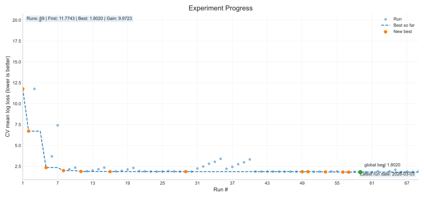

# WildlifeVision-Baseline
The baseline with scikit-learn to practice how to make a model for the object classification for wildlife species. 
카메라트랩 이미지를 scikit-learn 기반 전통 특징으로 분류하고, site 단위 일반화 성능을 검증·제출까지 완주하는 학습형 CV 프로젝트

> **Traditional CV → Probabilistic Classifier → GroupKFold (site) → Submission**
> 

> 공모전: https://www.drivendata.org/competitions/87/competition-image-classification-wildlife-conservation/
> 
> 
> 현재 단계: **HOG feature 기반 Logistic Regression 모델의 성능 향상을 위한 미세 조정**
> 

---

> ## Executive Summary
> 
- 문제: 카메라트랩 이미지 분류는 **촬영 환경 변화**가 크고, 무작위 분할로 평가하면 실제 성능을 과대평가하기 쉽다.
- 해결: 이미지에서 **“Histogram of Oriented Gradients, HOG” 특징을 추출**하고 **scikit-learn 확률 분류기**로 학습하되, 검증은 **GroupKFold**로 고정하여 “site 일반화”를 반영한다.

> Performance Progress
> |**current best score (Log Loss): Mar 1, 2026**|
> |---|
> | `~=1.8029` |



> ## Experiments

| EXP ID | Summary | CV (mean log loss) | Leaderboard (log loss : rank) | Report | Assets |
|---|---|---:|---:|---|---|
| EXP_LOGREG_HOG_002 | LogReg + HOG baseline & grid (GroupKFold by site) | **1.8639** | **1.9354** : `358/557` | [Report](docs/experiments/EXP_LOGREG_HOG_002.md) | [Imgs](docs/assets/imgs/EXP_LOGREG_HOG_002/) |
| EXP_LOGREG_HOG_003 | Focused tuning around best log (`n_splits=6`, `C around 0.003`, `class_weight=balanced`) | **1.8557** | **1.9318** : `359/579` | [Report](docs/experiments/EXP_LOGREG_HOG_003/EXP_LOGREG_HOG_003.md) | - |
| EXP_LOGREG_HOG_004 | | **1.8029** | **1.9154** : `357/581` | [Report](docs/experiments/EXP_LOGREG_HOG_004/EXP_LOGREG_HOG_004.md) | - |

> ## Repository Structure
>
* `data/` : 원본 zip 압축 해제 파일/폴더(읽기 전용, repo에 업로드하지 않음)
* `notebooks/` : 탐색/시각화/실험 기록용 노트북
* `src/` : 전처리/특징추출/학습/평가 로직 (함수 단위 모듈)
* `artifacts/` :  실행 산출물 (가공 테이블, 특징 캐시, 모델, 리포트, 제출물) (로컬 전용)
  
  * `processed/` :  학습/테스트 테이블 등 가공 데이터 저장
  * `features/` :  HOG 등 특징 벡터 캐시 저장
  * `models/` :  학습된 모델 파일 저장
  * `reports/` :  실험 결과 요약/그래프 저장
  * `submissions/` :  제출 CSV 파일 보관(버전 관리)


>The Pan African Programme: The Cultured Chimpanzee, Wild Chimpanzee Foundation, DrivenData. (2022). Conser-vision Practice Area: Image Classification. Retrieved 02-11-2026 from https://www.drivendata.org/competitions/87/competition-image-classification-wildlife-conservation/.


## Runbook: HOG 튜닝 -> `run_id` 기반 제출

1. HOG 튜닝 실험 실행:

```bash
python -m src.experiments.run_hog_tune --base_dir . --n_splits 5 --seed 42
```

- 로그는 `artifacts/experiments/experiments.jsonl`에 한 줄씩 추가됩니다.
- 각 실험은 `tag`로 구분됩니다(예: `hog_tune_v1__ori_12`).
- 로그 스키마는 아래 필드를 유지합니다:
  `run_id, timestamp, env, tag, feature_name, model_name, cv, params, metrics, data_signature, cv_checks, fold_site_counts`
- 아래는 실제 실험 로그 1줄입니다.
  ```
    {"run_id": "91d73dbc9d", "timestamp": "2026-03-01T05:33:39.689359+00:00", "env": {"python": "3.12.10", "sklearn": "1.8.0"}, "tag": "hog_tune_v1__cpb_3x3", "feature_name": "hog", "model_name": "logreg", "cv": {"type": "GroupKFold(site)", "n_splits": 5}, "params": {"logreg": {"C": 0.003, "max_iter": 6000, "use_scaler": false, "class_weight": "balanced", "solver": "lbfgs", "random_state": 42}, "hog": {"pixels_per_cell": [8, 8], "cells_per_block": [3, 3], "orientations": 9, "block_norm": "L2-Hys", "tiled": false}}, "metrics": {"mean_log_loss": 1.8572156815071872, "std_log_loss": 0.09373077381970896, "fold_log_loss": [1.967952720563294, 1.9480761662756538, 1.8303029869951282, 1.708933614853802, 1.8308129188480584]}, "data_signature": {"n_samples": 16488, "n_sites": 148, "class_counts": {"antelope_duiker": 2474, "bird": 1641, "blank": 2213, "civet_genet": 2423, "hog": 978, "leopard": 2254, "monkey_prosimian": 2492, "rodent": 2013}}, "cv_checks": {"site_single_fold": true, "no_site_overlap": true, "random_state": 42}, "fold_site_counts": {"0": 30, "1": 30, "2": 30, "3": 29, "4": 29}}```

2. `experiments.jsonl`에서 원하는 실험의 `run_id`를 선택합니다.

3. 선택한 `run_id`의 로그 파라미터로 모델을 재현한 뒤, test 추론 및 제출 파일 생성:

```bash
python -m src.submit --run_id 58ba15d713 --base_dir .
```

- `src.submit` 동작 순서:
  1. run_id로 실험 로그 조회
  2. 로그 파라미터로 HOG + LogReg 재현
  3. test 추론 
  4. submission CSV 저장
- 선택한 실험 로그에 `error`가 기록되어 있으면 제출 생성을 차단합니다.


